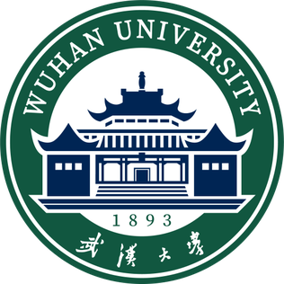
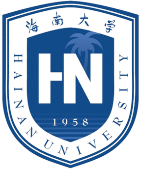

I'm currently a M.Sc. student at the School of Cyber Science and Engineering, [Wuhan University](https://en.whu.edu.cn/). I'm a member of Autonomous, Sustainable Automotive Protection Research Group ([ASAP Research Group](https://yuecaowix.wixsite.com/yuecao)), fortunately advised by Prof. [Yue Cao](https://scholar.google.com/citations?hl=en&user=lckgBe4AAAAJ). 

My current research interests include intrusion detection and IoT security. The primary objective of my research is to develop non-passive and self-adaptive ML solutions, which could enhance the robustness of security defense systems in complex, heterogeneous, and dynamic real-world network environments.

Prior to my current studies, I earned my B.Sc. degree from [Hainan University](https://en.hainanu.edu.cn/). During my undergraduate years, I built a foundational background through several research projects and internships in integrated detection capabilities, AI-driven SecOps, and vehicular network security. Special thanks to Dr. [Yifeng Wang](https://www.researchgate.net/scientific-contributions/Yifeng-Wang-2210586583), [Zilin Huang](https://www.researchgate.net/scientific-contributions/Zilin-Huang-2296718482), and my many collaborators for invaluable guidance and partnership.

<!-- ## Updates

* \[September 2025\] Event 1

* \[May 2025\] Event 2

-->

## Education

    

        
    

    

        
<b>Sep. 2025 - Jun. 2027 (expected)</b>, School of Cyber Science and Engineering, Wuhan University

        
M.Sc. Electronic and Information Engineering

    

    

        
    

    

        
<b>Sep. 2021 - Jun. 2025</b>, School of Cyberspace Security / School of Cryptology, Hainan University

        
B.Sc. Information Security

    

## Research

***Further research findings are anticipated in the near future...***



## Industry Experience

    

        
    

    

        
<b>Feb. 2025 - Apr. 2025</b>, China Telecom

        
Security Engineer Intern

    

    

        
    

    

        
<b>Jul. 2022 - Aug. 2022</b>, Qihoo 360

        
Security Engineer Apprentice

    

 
 
## Miscellaneous

* Lover of travel and photography. View some of my work [<b>here</b>](/photography/) 🌏📷.
* Ex-school organizer, [CYVA](https://www.linkedin.com/company/chinese-young-volunteers-association/). Passionate about building a better community 🤝❤️.
* Born and raised in [one of the spiciest regions](https://thechina.travel/explore/food/China's-Spiciest-Province-How-Fierce-Is-Their-Chili-Pepper-Rivalry/) on Earth 🔥🌶️.
* Long-term swimming enthusiast. My favorite way to recharge 🏊🔋.

    

    <i>Last updated: Apr. 15, 2026.</i>
     
    <i>Modified from <a href="https://github.com/yaoyao-liu/minimal-light">this template</a>.</i>

